# TaskMaster API — DevOps & Cloud Portfolio Project

Este proyecto no trata sobre la API en sí — la aplicación (un backend simple
de gestión de tareas en FastAPI) es solo el "cargo" que viaja dentro de la
verdadera pieza central: la arquitectura que la rodea.

El foco está en cómo mantener esa API corriendo en producción de forma
segura, observable y automatizada: alguien puede modificar el código de la
aplicación, subir ese cambio, y el pipeline se encarga de testearlo,
escanearlo en busca de vulnerabilidades, construir la imagen y desplegarla
sin intervención manual — con alarmas, dashboards y auto-scaling
reaccionando en tiempo real a lo que pase en producción.

Este proyecto de portfolio cubre infraestructura como código, CI/CD,
seguridad integrada (DevSecOps), observabilidad, y un módulo comparativo de
Kubernetes — con foco en el stack más solicitado en ofertas junior/semi-senior
de DevOps y Cloud Engineering en Latinoamérica.

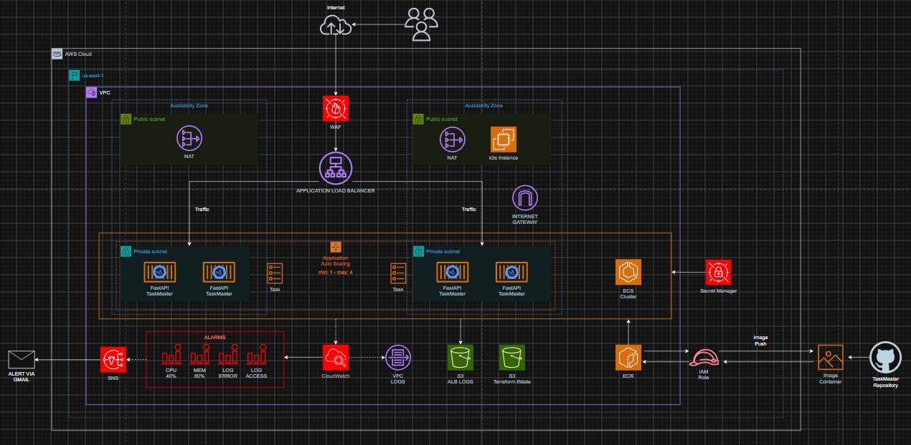

## Índice

1. [Stack tecnológico](#stack-tecnológico)
2. [Arquitectura — AWS (ECS Fargate)](#arquitectura--aws-ecs-fargate)
3. [Pipeline de CI/CD](#pipeline-de-cicd)
4. [Seguridad](#seguridad)
5. [Observabilidad](#observabilidad)
6. [Kubernetes (k3s)](#kubernetes-k3s)
7. [Demos](#demos)
8. [Decisiones de diseño y trade-offs](#decisiones-de-diseño-y-trade-offs)
9. [Cómo reproducirlo](#cómo-reproducirlo)
10. [Lecciones aprendidas](#lecciones-aprendidas)

---

## Stack tecnológico


| Categoría | Tecnología |
|---|---|
| **Aplicación** | Python · FastAPI · pytest |
| **Contenedores** | Docker |
| **Infraestructura como código** | Terraform |
| **Cloud** | AWS — ECS Fargate, ALB, VPC, EC2, ECR, IAM, Secrets Manager, CloudWatch, WAF, SNS |
| **Orquestación (comparativa)** | Kubernetes (k3s) |
| **CI/CD** | GitHub Actions · autenticación OIDC |
| **Seguridad** | Checkov · Trivy · AWS WAF · KMS |
| **Observabilidad** | CloudWatch — alarmas, dashboard, Flow Logs, Container Insights |

---

## Arquitectura — AWS (ECS Fargate)

### Red

La API corre dentro de una VPC propia, distribuida en 2 zonas de
disponibilidad para tolerar la caída de una AZ completa. Cada zona tiene una
subred pública y una privada:

- **Subredes públicas:** alojan el ALB y el NAT Gateway. Tienen ruta directa
  a internet vía Internet Gateway.
- **Subredes privadas:** alojan las tasks de ECS Fargate. No tienen IP
  pública ni ruta directa a internet — su única salida es a través del NAT
  Gateway, y su único tráfico entrante permitido es el que llega desde el ALB.

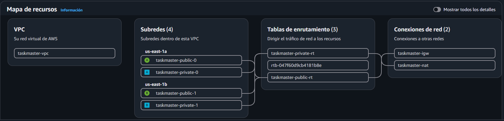

### Balanceo y cómputo

El **Application Load Balancer** recibe el tráfico externo y lo distribuye
hacia las tasks de **ECS Fargate**, verificando su salud contra el endpoint
`/health` antes de enviarles tráfico. Fargate elimina la necesidad de
administrar instancias EC2 subyacentes: cada task es un contenedor aislado,
administrado directamente por AWS.

El ALB también cuenta con **access logging** habilitado, guardando cada
petición recibida en un bucket S3 dedicado — útil para auditoría y
troubleshooting posterior.

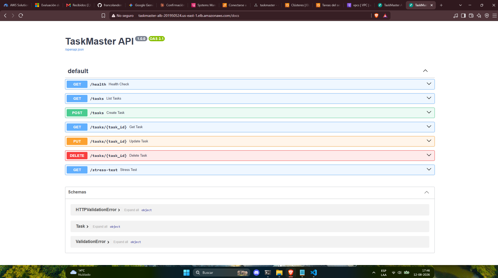

### Auto Scaling

El servicio de ECS escala automáticamente entre 1 y 4 tasks según el uso de
CPU, usando una política de *target tracking* con un umbral del 40%. Ante un
pico de tráfico o carga, el sistema agrega tasks de forma automática sin
intervención manual — y las retira cuando la demanda baja, optimizando
costos.

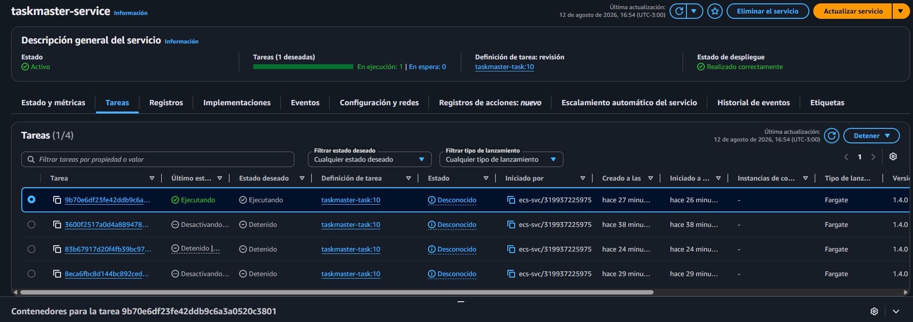

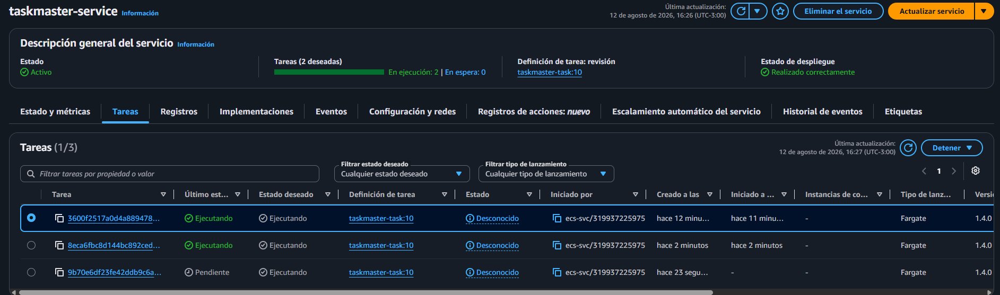

### WAF

Un **AWS WAF** (Web Application Firewall) se sitúa delante del ALB,
inspeccionando cada petición entrante antes de que llegue a la aplicación.
Usa 2 conjuntos de reglas administradas por AWS: protecciones genéricas
contra ataques web comunes (OWASP Top 10, como XSS o payloads anómalos) y
detección de patrones de entrada maliciosos conocidos.

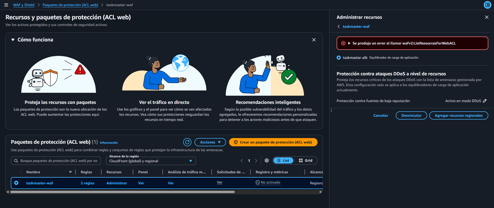

### Secretos y registro de imágenes

- **Secrets Manager** almacena una API key generada dinámicamente, cifrada
  con una KMS key propia del proyecto, e inyectada al contenedor como
  variable de entorno segura (nunca como texto plano en el código o en la
  definición de la task).
- **ECR** aloja las imágenes Docker de la aplicación, versionadas por cada
  build del pipeline de CI/CD.

### Observabilidad de la arquitectura

**CloudWatch** centraliza toda la visibilidad de la infraestructura:

- **4 alarmas activas**, cada una notificando por email vía un tópico de
  **SNS** ante un evento anómalo:
  - `cpu-high`: CPU del servicio por encima del 40% durante 2 períodos
    seguidos (umbral bajado deliberadamente para poder probarla con
    facilidad, ver sección de Observabilidad más abajo).
  - `memory-high`: memoria por encima del 80%.
  - `alb-5xx-errors`: más de 5 errores 5xx del servidor en un minuto.
  - `unhealthy-hosts`: el Target Group reporta hosts no saludables.
- **Dashboard** con 4 widgets: CPU/memoria del contenedor, peticiones y
  errores del ALB, salud del Target Group, y tiempo de respuesta.
- **VPC Flow Logs**: registra todo el tráfico de red dentro de la VPC,
  almacenado en su propio log group cifrado.
- **Container Insights**: métricas detalladas a nivel de cluster/tasks de
  ECS.

### Almacenamiento de soporte (S3)

Dos buckets S3 cumplen roles de infraestructura, no de aplicación:

- **ALB access logs**: guarda cada petición recibida por el ALB (lifecycle
  de 30 días).
- **Terraform state**: backend remoto de Terraform, con locking nativo vía
  `use_lockfile` (sin necesidad de una tabla DynamoDB adicional).

Los **VPC Flow Logs**, en cambio, se envían directamente a un log group de
CloudWatch (no a S3).

### Módulo comparativo: Kubernetes (k3s)

Además de ECS Fargate, el proyecto incluye una instancia EC2 corriendo
**k3s** (una distribución liviana de Kubernetes), como ejercicio comparativo
entre ambos modelos de orquestación de contenedores. Este módulo se
desarrolla en detalle en la sección [Kubernetes (k3s)](#kubernetes-k3s) más
abajo.

---

## Pipeline de CI/CD

Cada push al repositorio dispara un pipeline de GitHub Actions con 4 jobs
encadenados, diseñado para detener el despliegue apenas algo falla — nada
llega a AWS sin pasar antes por tests y escaneo de seguridad.

```
test (pytest) ──┐
                 ├──> build-and-push (Docker + ECR) ──> deploy (ECS)
security-scan ───┘
```

1. **`test`**: corre la suite de tests con `pytest` sobre el código de la
   aplicación.
2. **`security-scan`**: corre en paralelo con `test`. Escanea la
   infraestructura con **Checkov** y la imagen/dependencias con **Trivy**
   (más detalle en la sección [Seguridad](#seguridad)).
3. **`build-and-push`**: solo arranca si `test` y `security-scan` terminaron
   bien (`needs: [test, security-scan]`). Construye la imagen Docker y la
   sube a ECR.
4. **`deploy`**: fuerza un nuevo despliegue en ECS (`force-new-deployment`),
   haciendo que el servicio descargue la imagen recién publicada.

### Autenticación sin credenciales fijas (OIDC)

El pipeline no usa access keys ni secretos estáticos guardados en GitHub.
En su lugar, se autentica contra AWS mediante **OpenID Connect (OIDC)**: un
Identity Provider configurado en IAM, junto a un Role acotado
específicamente a este repositorio, permite que GitHub Actions asuma
credenciales temporales solo durante la ejecución del workflow. Esto elimina
el riesgo de tener una credencial de larga duración expuesta en la
configuración del repo.

### Comportamiento verificado

Se probó de punta a punta que un test roto detiene el pipeline **antes** de
tocar cualquier recurso de AWS — ni siquiera llega a construir la imagen.
Esto se documenta con una demostración concreta más abajo, en la sección
[Demos](#demos).

---

## Seguridad

La seguridad se integró desde el diseño, no como un paso posterior:
escaneo automático en cada push, cifrado en reposo con KMS, autenticación
sin credenciales fijas, y un firewall de aplicación delante del tráfico
público. Esta sección documenta tanto lo implementado como las decisiones
conscientes de aceptar ciertos hallazgos, con su justificación.

### Checkov — escaneo de infraestructura

Cada push corre **Checkov** contra el código Terraform, con `soft_fail: true`
(el pipeline reporta hallazgos pero no bloquea el despliegue por ellos —
la decisión de aceptar o corregir cada uno se toma de forma consciente,
no automática).

Se corrigieron progresivamente: falta de descripciones en Security Groups,
configuración de lifecycle incompleta en buckets S3, cifrado KMS faltante en
SNS, log groups de CloudWatch y Secrets Manager, volumen EBS de la instancia
EC2 sin cifrar, monitoreo detallado deshabilitado, EBS optimization
deshabilitada, e IMDSv1 habilitado en lugar de forzar IMDSv2.

Quedan **7 categorías de hallazgos aceptados de forma consciente**:

| Hallazgo | Descripción | Por qué se aceptó |
|---|---|---|
| `CKV_AWS_382` | Security Groups permiten egress abierto (0.0.0.0/0) | Necesario para que ECS descargue imágenes de ECR, la instancia de k3s se actualice, y el ALB responda con libertad |
| `CKV_AWS_2` | El ALB no usa HTTPS | Requiere un dominio propio + certificado ACM; pospuesto por presupuesto en esta iteración del proyecto |
| `CKV_AWS_260` | El Security Group del ALB permite ingress público al puerto 80 | Mismo motivo que arriba — es la contracara de no tener HTTPS todavía |
| `CKV_AWS_130` | Las subredes públicas asignan IP pública por defecto | Intencional: el ALB y la instancia de k3s necesitan ser alcanzables desde internet |
| `CKV_AWS_88` | La instancia EC2 de k3s tiene IP pública | Mismo motivo — decisión consciente de subred pública, explicada en la sección de Kubernetes |
| `CKV_AWS_338` | Los log groups de CloudWatch retienen logs por menos de 1 año | Decisión de costo: 7 días de retención, suficiente para un proyecto de demostración |
| `CKV_AWS_150` | El ALB no tiene deletion protection habilitada | Activarla rompería el flujo de `terraform destroy` usado para llevar el gasto a $0 entre sesiones de trabajo |

> **Nota técnica:** durante esta etapa se encontró y corrigió un bug real —
> los campos `kms_key_id` / `kms_master_key_id` habían quedado escritos
> dentro del bloque `tags` de varios recursos en lugar de ser un argumento
> de nivel superior. Terraform los interpretaba como una etiqueta más de
> texto, sin efecto real de cifrado, y Checkov seguía reportando el
> hallazgo hasta que se detectó comparando la configuración real contra el
> resultado del escaneo.

### Trivy — escaneo de imagen y dependencias

Cada push escanea la imagen Docker con **Trivy**, buscando vulnerabilidades
conocidas tanto en las dependencias de Python como en el sistema operativo
base de la imagen.

**Dependencias de Python:** 100% limpias, sin vulnerabilidades reportadas.

**Sistema operativo base (Debian, imagen `python:3.13-slim`):** se
reportan **11 vulnerabilidades HIGH/CRITICAL**, todas en paquetes del
sistema (no en código propio del proyecto):

| Paquete afectado | Cantidad | Por qué se aceptó |
|---|---|---|
| `gzip`, `libacl1`, `ncurses`, `perl-base` (y similares) | 11 | Vulnerabilidades reportadas por el proveedor de Debian, sin parche disponible todavía al momento del escaneo — no es negligencia, el fix no existe. Ninguno de estos paquetes es invocado por el runtime de la API (riesgo real bajo, ya que no forman parte de la superficie de ejecución de la aplicación) |

El job usa `exit-code: 0` (no bloquea el pipeline), ya que estas
vulnerabilidades de la imagen base están fuera del control directo del
código de la aplicación — se revisan periódicamente para aplicar el parche
en cuanto el proveedor lo publique.

> **Nota técnica pendiente:** el workflow usa
> `aquasecurity/trivy-action@master` en lugar de una versión fijada
> (ej. `@0.24.0`), porque esa versión específica no se pudo resolver desde
> el marketplace al momento de configurar el pipeline. Queda anotado como
> mejora futura: fijar a una versión específica una vez confirmada su
> disponibilidad.

### AWS WAF

Un **Web Application Firewall** se asocia directamente al ALB, inspeccionando
cada petición entrante antes de que llegue a la aplicación. A diferencia de
Checkov y Trivy (que escanean código e imágenes antes del despliegue), el
WAF actúa en tiempo real sobre el tráfico en producción.

Usa 2 conjuntos de reglas administradas por AWS (no reglas personalizadas
desde cero, que requerirían mantenimiento propio):

| Regla | Qué protege |
|---|---|
| `AWSManagedRulesCommonRuleSet` | Protecciones genéricas basadas en OWASP Top 10 — XSS, tamaños de request anómalos, patrones de exploits comunes |
| `AWSManagedRulesKnownBadInputsRuleSet` | Payloads maliciosos conocidos y patrones de entrada peligrosos |

**Decisión de alcance:** el WAF protege únicamente el tráfico que pasa por
el ALB (el lado de ECS Fargate). El módulo de Kubernetes (k3s) expone su
servicio de prueba directamente vía NodePort, sin pasar por el ALB ni por el
WAF — una asimetría intencional, ya que ese módulo es un ejercicio
comparativo de orquestación, no una segunda superficie de producción a
proteger con el mismo nivel de profundidad.

---

## Observabilidad

Toda la visibilidad de la infraestructura se centraliza en **CloudWatch**,
con notificaciones activas ante eventos anómalos y un dashboard consolidado
para monitoreo en vivo.

### Alarmas

| Alarma | Condición | Qué detecta |
|---|---|---|
| `cpu-high` | CPU > 40% durante 2 períodos seguidos | Carga alta en el servicio (dispara también el Auto Scaling de ECS) |
| `memory-high` | Memoria > 80% durante 2 períodos seguidos | Consumo de memoria anómalo |
| `alb-5xx-errors` | Más de 5 errores 5xx en 1 minuto | Fallas del lado del servidor |
| `unhealthy-hosts` | Target Group reporta hosts no saludables | Problemas de salud en las tasks |

Las 4 alarmas notifican por email a través de un tópico de **SNS**, cifrado
con KMS.

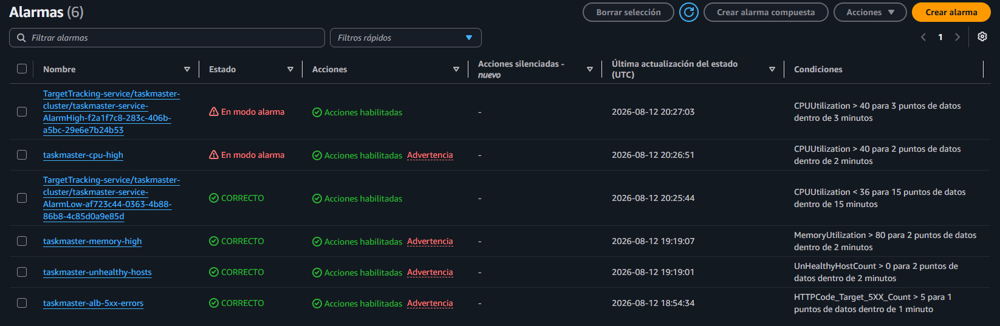

**Decisión consciente sobre el umbral de CPU:** la alarma `cpu-high` está
configurada al 40%, no al 80% que sería más habitual en producción real. Se
bajó deliberadamente para poder probarla y verificar su disparo real con
facilidad — la API es liviana y raramente superaría el 40% de CPU en uso
normal, así que un umbral más alto rara vez se activaría en un entorno de
demostración. Este mismo umbral se reutiliza como *target* de la política de
Auto Scaling, manteniendo coherencia entre ambos mecanismos.

### Dashboard

Un dashboard de CloudWatch con 4 widgets:

1. CPU y memoria del contenedor
2. Peticiones y errores del ALB
3. Salud del Target Group
4. Tiempo de respuesta del ALB

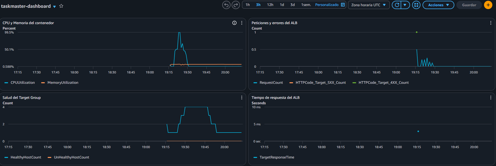

### VPC Flow Logs y Container Insights

- **VPC Flow Logs**: registra todo el tráfico de red dentro de la VPC en un
  log group dedicado y cifrado.
- **Container Insights**: métricas detalladas a nivel de cluster y tasks de
  ECS, habilitado sobre el cluster.

### Endpoint de prueba: `/stress-test`

La aplicación incluye un endpoint `/stress-test`, que ejecuta un bucle de
~150 segundos consumiendo CPU de forma artificial. Se agregó específicamente
para poder disparar y verificar la alarma `cpu-high` y la política de Auto
Scaling de forma controlada y repetible, sin depender de tráfico real. Se
mantiene documentado como endpoint de demostración, no como parte de la
funcionalidad de negocio de la API.

---

## Kubernetes (k3s)

Además de ECS Fargate, el proyecto incluye un módulo comparativo desplegando
la misma imagen de la API sobre **k3s**, una distribución liviana de
Kubernetes, corriendo sobre una única instancia EC2. El objetivo de este
módulo no es reemplazar la arquitectura de ECS, sino documentar de primera
mano las diferencias reales entre ambos modelos de orquestación.

### Arquitectura del módulo

- **Instancia EC2** (`t3.small`) en una subred pública, con k3s instalado
  automáticamente vía `user_data` al arrancar.
- **Acceso administrativo** vía AWS Systems Manager Session Manager — sin
  SSH, sin llaves, sin el puerto 22 expuesto a internet.
- **IAM Role** con permisos mínimos: `AmazonSSMManagedInstanceCore` (para
  Session Manager) y `AmazonEC2ContainerRegistryReadOnly` (para descargar la
  imagen desde ECR).
- **Security Group**: sin ingress de administración expuesto; solo el
  puerto `6443` (API de Kubernetes) accesible dentro de la VPC, y el rango
  `30000-32767` (NodePort) accesible para exponer el servicio de prueba.
- **Deployment de Kubernetes**: 2 réplicas de la misma imagen que corre en
  ECS, reusando el mismo repositorio de ECR.
- **Service tipo NodePort**: expone la API en el puerto `30080` de la
  instancia.

### Autenticación contra ECR

A diferencia de ECS (donde AWS gestiona la autenticación contra ECR de
forma transparente), k3s requiere un paso manual: un Secret de Kubernetes
tipo `docker-registry`, generado con un token temporal de ECR (válido por
12 horas). Es una de las diferencias operativas más notorias entre ambos
modelos.

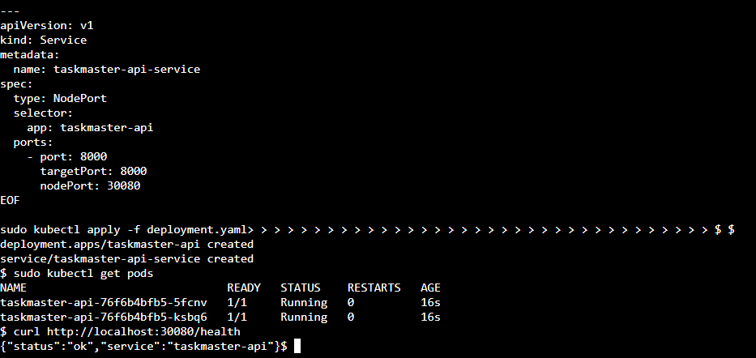

### Comparación con ECS Fargate

| Aspecto | ECS Fargate | k3s |
|---|---|---|
| Complejidad de la infraestructura | Más simple de levantar — VPC, ALB, ECS integrados de forma nativa por AWS | Más pasos manuales de configuración, pero mayor comprensión de lo que ocurre por debajo |
| Autenticación contra ECR | Automática, gestionada por AWS | Manual, vía Secret con token temporal (vence a las 12hs) |
| Balanceo de tráfico | ALB dedicado, con health checks, WAF y métricas nativas | Service tipo NodePort — sin balanceador dedicado, sin WAF, sin métricas integradas |
| Resiliencia | Multi-AZ, con Auto Scaling entre 1 y 4 tasks | Nodo único — la resiliencia real requeriría un cluster multi-nodo, fuera del alcance de este módulo |
| Curva de aprendizaje | Menor control, mayor abstracción | Mayor control, requiere entender los fundamentos (Pods, Deployments, Services) |
| Alcance implementado en este proyecto | Completo: ALB, métricas, pipeline de CI/CD integrado | Fundamentos únicamente — no incluye Ingress, monitoreo tipo Prometheus, ni CI/CD propio |

### Conclusión honesta

Este módulo no representa experiencia de Kubernetes en producción. Sí
demuestra comprensión práctica y verificada de sus fundamentos —Pods,
Deployments, Services— trabajando en un entorno real, con conciencia clara
de hasta dónde llega ese conocimiento y qué quedaría por explorar en un
escenario de producción real (cluster multi-nodo, Ingress, gestión de
secretos más robusta, observabilidad equivalente a la de ECS).

---

## Demos

Estas demostraciones fueron pensadas para ilustrar el pipeline en
funcionamiento con casos reales, más allá de las capturas estáticas del
resto del README.

### Demo 1 — El pipeline detiene un cambio roto

Objetivo: demostrar que un error real en la aplicación (no un test
sintético) es detectado y frenado por el pipeline antes de llegar a
producción.

1. Se cambió el código de respuesta de `POST /tasks` de `201` a `200`,
   rompiendo el contrato esperado por un test existente.
2. Se hizo push del cambio.
3. El job `test` falló con `AssertionError: assert 200 == 201`, deteniendo
   el pipeline antes de llegar a `build-and-push` y `deploy` — ningún
   recurso de AWS se vio afectado.

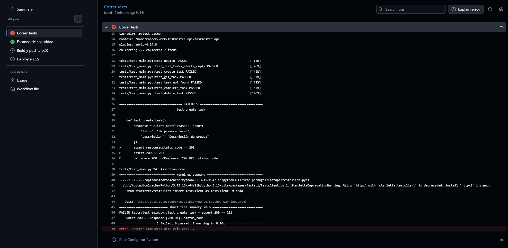

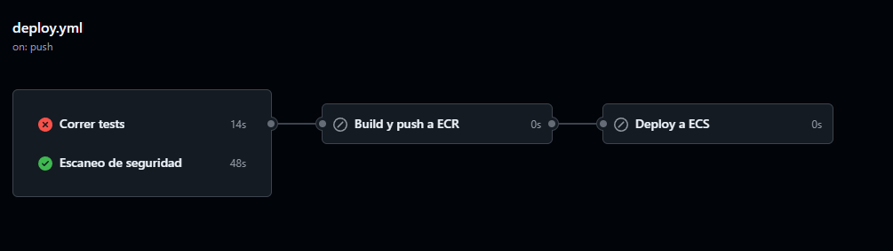

4. Se revirtió el error, y se confirmó que el pipeline corre de punta a
   punta normalmente.

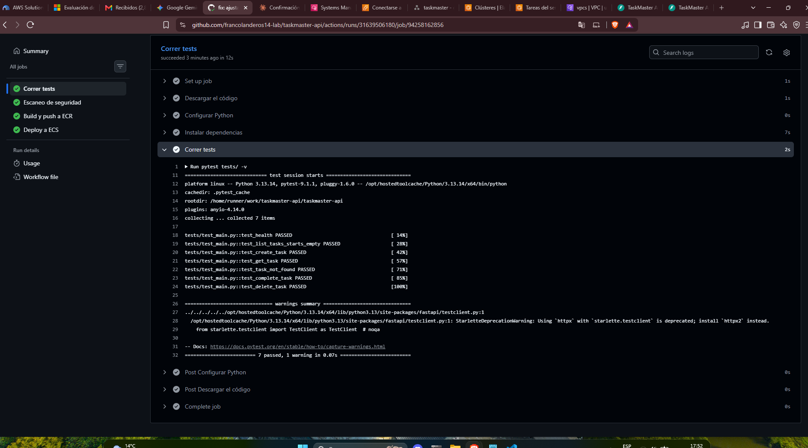

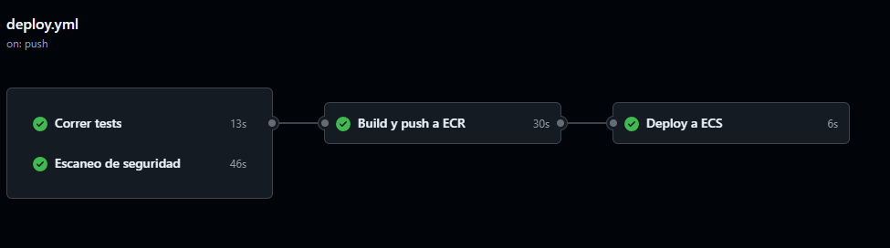

### Demo 2 — Nueva funcionalidad desplegada end-to-end

Objetivo: mostrar el flujo completo de un cambio real y funcional, desde el
código hasta producción, sin intervención manual.

1. Se agregó el endpoint `GET /tasks/completed`, que filtra y devuelve
   solo las tareas marcadas como completadas.
2. Se agregó un test correspondiente a la suite de `pytest`.
3. Se hizo push del cambio.
4. El pipeline corrió completo: tests, escaneo de seguridad, build, y
   despliegue automático en ECS.
5. Se verificó la funcionalidad nueva funcionando en producción, visible
   y documentada automáticamente en el Swagger UI a través del ALB.

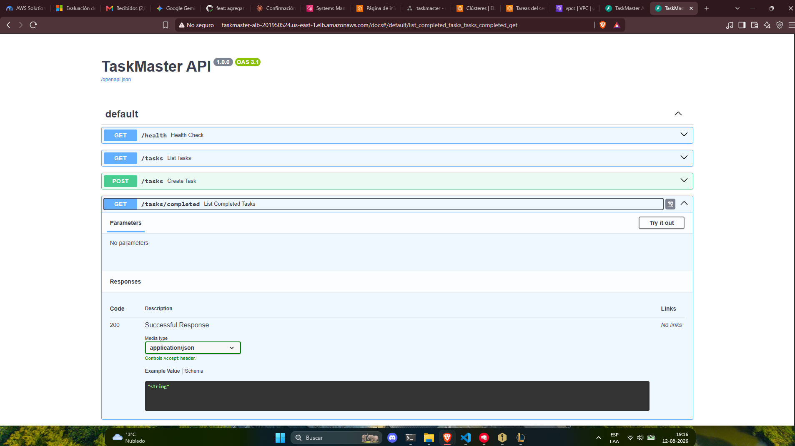

---

## Decisiones de diseño y trade-offs

Este proyecto tomó varias decisiones conscientes, priorizando el
aprendizaje y las restricciones reales de un proyecto personal por sobre
lo que sería "ideal" en un entorno de producción con presupuesto abierto.
Documentarlas explícitamente es tan importante como el código en sí.

| Decisión | Motivo |
|---|---|
| Sin dominio propio ni HTTPS en el ALB | Requiere presupuesto adicional (compra de dominio); pospuesto para una futura iteración |
| Umbral de alarma de CPU en 40% en vez de 80% | Permite disparar y verificar la alarma y el Auto Scaling de forma controlada, sin depender de tráfico real |
| Instancia de k3s en subred pública, con IP pública | Simplifica el acceso al NodePort de prueba sin agregar un Load Balancer adicional al módulo comparativo |
| k3s en un solo nodo, sin alta disponibilidad real | El objetivo del módulo es demostrar comprensión de fundamentos, no replicar una arquitectura de producción completa |
| Retención de logs de CloudWatch en 7 días | Decisión de costo — suficiente para las necesidades de un proyecto de demostración |
| Sin deletion protection en el ALB | Necesario para poder ejecutar `terraform destroy` libremente entre sesiones de trabajo y mantener el gasto en $0 |
| `terraform apply` / `destroy` como flujo de trabajo | Con un presupuesto acotado ($20-50 USD en créditos AWS), la infraestructura se levanta solo durante sesiones activas de trabajo, y se destruye por completo al finalizar |
| WAF y Auto Scaling agregados fuera del alcance de mercado laboral original | Se sumaron para reforzar el portfolio más allá del stack mínimo detectado en las ofertas laborales analizadas |

---

## Cómo reproducirlo

> ⚠️ Levantar esta infraestructura genera costos reales en AWS. Revisá el
> presupuesto estimado antes de aplicar.

### Requisitos previos

- Cuenta de AWS con permisos administrativos
- Terraform instalado
- AWS CLI configurado (`aws configure`)
- Docker (para build local, opcional — el pipeline lo hace automáticamente)
- Un fork o clon de este repositorio

### Pasos

1. Cloná el repositorio:
   ```bash
   git clone https://github.com/francolanderos14-lab/taskmaster-api
   cd taskmaster-api
   ```

2. Creá el archivo `terraform/terraform.tfvars` con tus propios valores:
   ```hcl
   alert_email = "tu-email@ejemplo.com"
   ```

3. Desplegá la infraestructura:
   ```bash
   cd terraform
   terraform init
   terraform apply
   ```

4. Configurá el secret `AWS_ROLE_ARN` en GitHub (Settings → Secrets and
   variables → Actions) con el valor del output `github_actions_role_arn`,
   para que el pipeline de CI/CD pueda autenticarse.

5. Cualquier push a la rama principal va a disparar el pipeline completo:
   tests, escaneo de seguridad, build, y despliegue.

6. Para el módulo de Kubernetes, conectate a la instancia EC2 vía Session
   Manager y seguí los pasos manuales documentados en la sección
   [Kubernetes (k3s)](#kubernetes-k3s).

7. Al finalizar, destruí la infraestructura para evitar costos:
   ```bash
   terraform destroy
   ```

---

## Lecciones aprendidas

Cierro este README con una reflexión honesta, pensada tanto para quien lea
el repo como para mi propio yo dentro de unos meses.

**Sobre el proceso, no solo el resultado:** este proyecto reforzó que el
verdadero trabajo de DevOps no es hacer que algo funcione una vez, sino
diseñarlo para que siga funcionando de forma segura, observable y
reproducible con el tiempo. Cada decisión — desde el umbral de una alarma
hasta por qué un hallazgo de seguridad se acepta en vez de corregirse —
tiene que poder explicarse, no solo aplicarse.

**Sobre errores en el camino:** varios de los pasos de esta etapa
implicaron corregir errores propios sobre la marcha — desde recursos
duplicados en Terraform (KMS keys repetidas en varios archivos) hasta un
bug de configuración donde el cifrado KMS terminó dentro de un bloque de
`tags` en vez de ser un argumento real del recurso, sin efecto alguno hasta
que se detectó comparando el hallazgo de Checkov contra el código real.
También apareció un permiso faltante (`kms:Decrypt` en el Execution Role de
ECS) que solo se hizo visible al ver las tasks fallar en producción, no en
ningún escaneo estático. Documentar estos errores, no solo el resultado
final prolijo, es parte de lo que hace útil este README a futuro.

**Sobre Kubernetes:** entrar a k3s sin experiencia previa, entendiendo los
fundamentos a mano en vez de saltar directo a un chart de Helm o una
plantilla lista, fue lo que más aportó en comprensión real — aunque el
resultado sea, a propósito, más simple que lo logrado en ECS.

**Lo que queda pendiente para una futura iteración:** dominio propio con
HTTPS real, un cluster de k3s multi-nodo, observabilidad tipo
Prometheus/Grafana como alternativa a CloudWatch, y ambientes separados de
staging/producción en el pipeline de CI/CD.